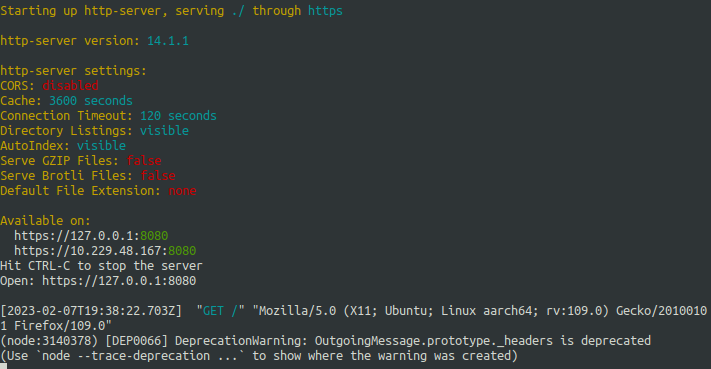
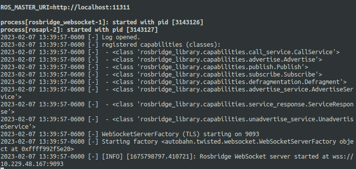
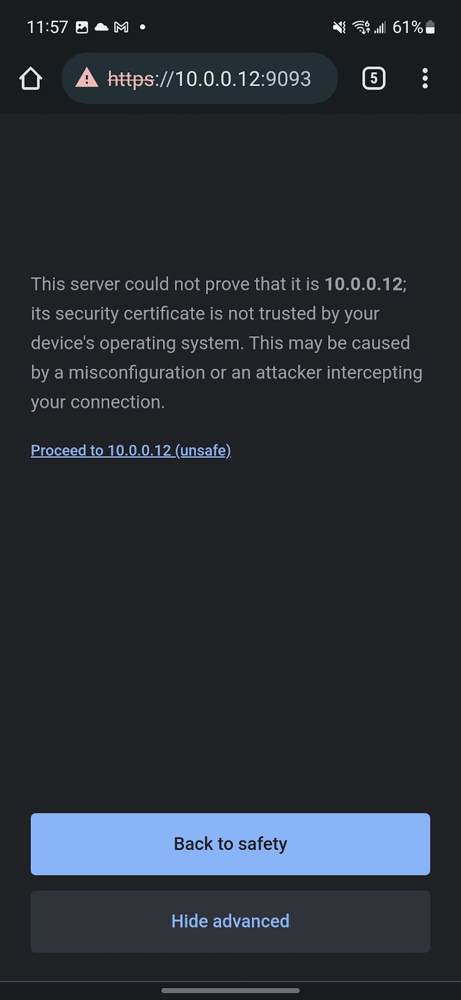
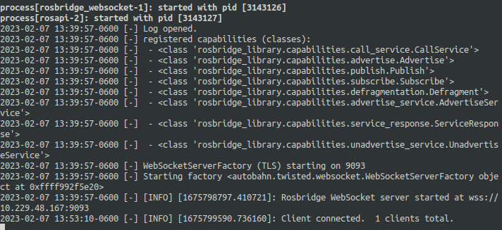

# Survivor Buddy Head Web Application Setup

## Web Server

Make sure you have npm and node installed.
Useful link here: https://medium.com/@iam_vinojan/how-to-install-node-js-and-npm-using-node-version-manager-nvm-143165b16ce1

Install http-server with the following command

```sh
npm install -g http-server
```

Then,

```sh
cd /to/sb_web/
```

And run

```sh
http-server -S -C cert.pem -o -K key.pem
```



## ROSbridge suite

Install ROSbridge suite with:

```sh
sudo apt install -y ros-noetic-rosbridge-suite
```

Then,

```sh
cd /to/sb_web/
```

Open rb_server.launch.

Change the address to the IP address that is shown by http-server.
Also change the certfile and keyfile paths to be the absolute path location to the certfile and keyfile on your installation of Ubuntu.


And run

```sh
roslaunch rb_server.launch
```



## Opening the web app

Find the IP address of the device that is hosting the http-server and the rosbridge server. The IP address should appear at the output when each of the servers were started.

Once that IP address has been found, on the device that will be serving as the head (phone on the Survivor Buddy or your own phone or computer when testing), open up the IP address and port of the rosbridge server. If my IP were 10.229.48.167 and the port were 9093 for the rosbridge server, I would navigate to `https://10.229.48.167:9093`.

Once there, you should see a warning that says that it is not secure- click on advanced or more information and continue to the site.



You should then see a blue screen that looks like the following.


Then navigate back to the IP address and port of the http-server and the sb_head html. Again, if my IP address were 10.229.48.167, I would navigate to `https://10.229.48.167:8080/sb_head.html`.


Then click connect to ROSbridge server, making sure the IP address and port in the fields are the correct address and port for the rosbridge server. Once connected, click on the record button to start transmitting the camera and audio data wirelessly to the instance of ROS running on your computer.



# Survivor Buddy Hardware Connection Setup

## ROSserial Connection

The microcontroller onboard the Survivor Buddy uses the rosserial library to communicate with ROS and send messages back and forth.

In order to connect to get the microcontroller up and running, first plug in the USB cable from the Survivor Buddy and make sure it is being detected by running the command

```sh
ls /dev/ttyUSB*
```

If the microcontroller is properly connected, you should see /dev/ttyUSB0 as the output of the previous command.

To connect the ROSserial node to your computer, run the following command

```sh
rosrun rosserial_python serial_node.py /dev/ttyUSB0
```


## Survivor Buddy Hardware Interface Connection

To finish the connection between MoveIt and the Survivor Buddy hardware, there is an interface script that translates the messages coming out of MoveIt to the correct message format that the microcontroller can understand.

To start this node, simply execute the interface layer script with

```sh
python3 sb_interface.py
```

If successful, there will be no output, just a lack of error messages.

You should now be receiving the camera data from the phone in the /camera/image/compressed topic and be receiving the audio data from the phone in the /audio topic. You should also be connected to the Survivor Buddy hardware so you can preview your actions in MoveIt and then see them executed on the physical robot.

Contact me at yashas.salankimatt@tamu.edu or the TA: Sheelabhadra Dey (sheelabhadra@tamu.edu) if you have any questions about these instructions.
